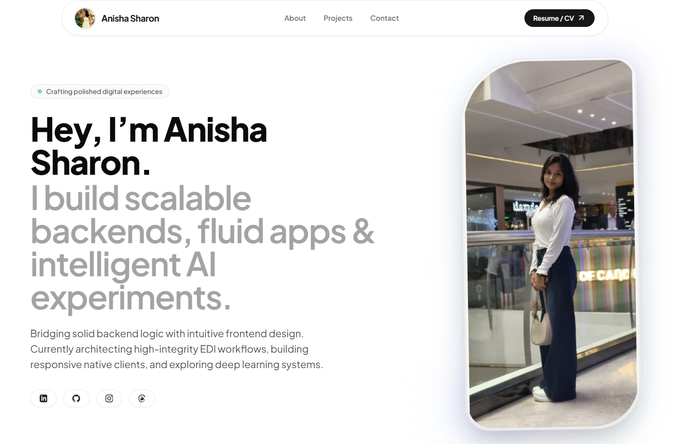
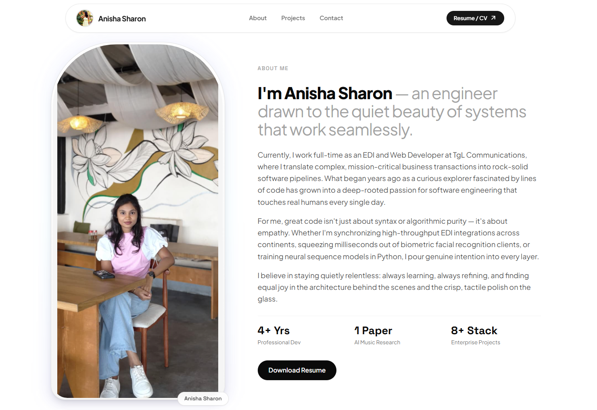
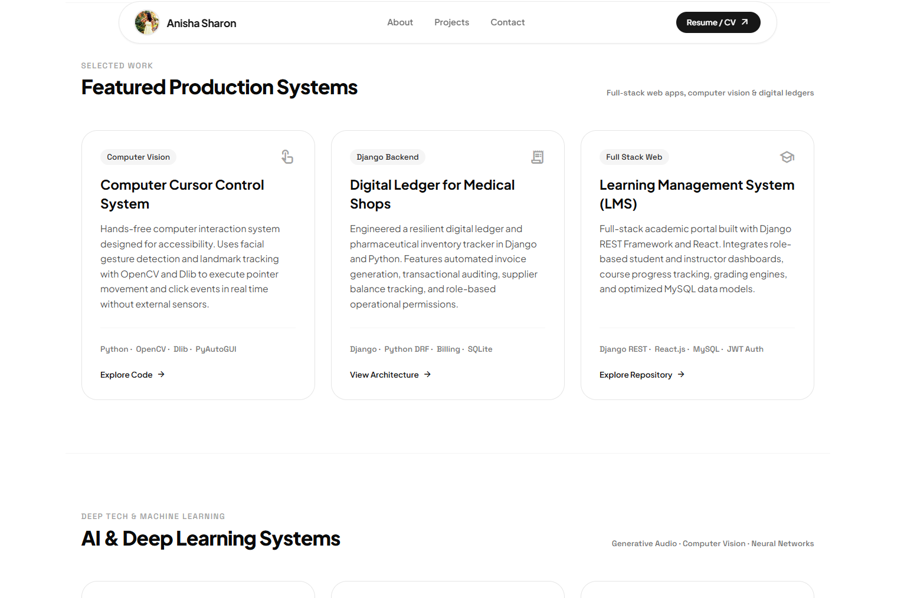

# Anisha Sharon — Portfolio Website

My personal developer portfolio — built, designed, and deployed by me.

🔗 **Live site:** https://portfolio-website-pearl-pi-71.vercel.app



## About this project

A fully responsive personal portfolio showcasing my experience as a Full Stack
Developer — covering my work history, technical skills, featured projects,
AI/ML experiments, published research, and a working contact form.

Designed with a modern, Gen-Z-forward UI/UX approach using AI-assisted design tooling (Stitch AI) for rapid visual prototyping, then hand-converted and engineered into a production-ready React codebase.

## Screenshots

| About | Projects |
|---|---|
|  |  |

## Built with

- **React** + **Vite**
- **Tailwind CSS**
- **Formspree** (contact form)
- Deployed on **Vercel**

## Sections

Home · About · Experience · Skills · Projects · AI & Deep Learning · Research · Education · Contact

## Run it locally

```bash
git clone https://github.com/Anisha-8/portfolio-website.git
cd portfolio-website
npm install
npm run dev
```

## Project structure
